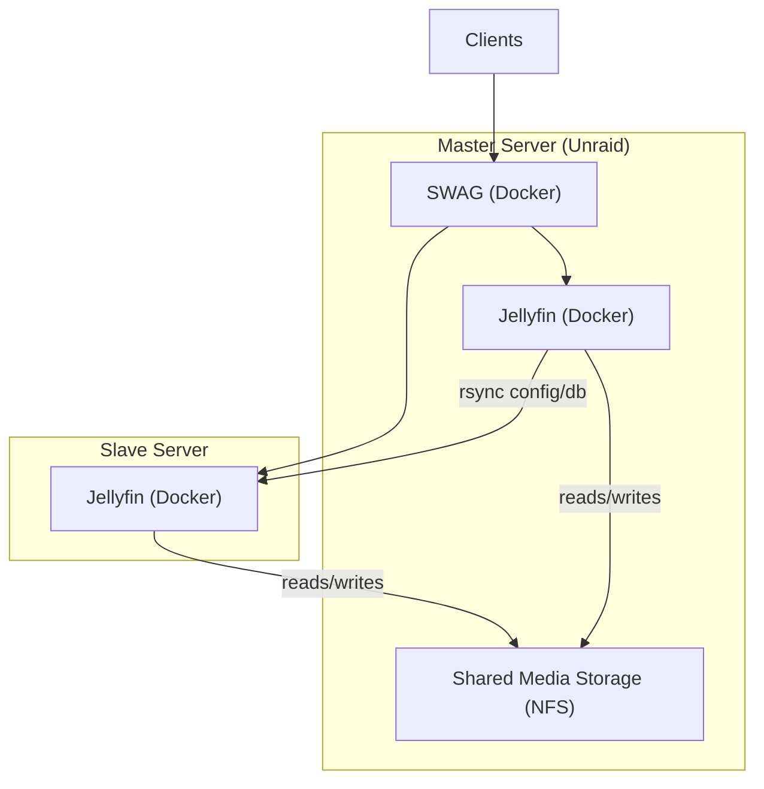

# Jellyfin Failover (Docker / SWAG / rsync)

## 🎯 Overview

This project provides a **practical failover solution for Jellyfin** running in Docker, designed for self-hosters who want reliability without complex HA infrastructure.

It synchronizes Jellyfin configuration and database from a **master server** to a **slave server**, and allows traffic to be redirected automatically using **SWAG**.

This is a **disaster recovery / failover setup**, not a real-time high-availability cluster.

---

## 🏗️ Architecture

### Key points

- Media files are stored on **shared NFS storage** on unraid
- Jellyfin configuration is synchronized using **rsync over SSH**
- The slave server is always powered on for fast recovery (in my case it run on my ISP router)
- The slave Jellyfin container runs continuously, even when the master is active, ready to take over in case of failover.

---

## ✨ Features

- Automated Jellyfin failover
- Safe stop/start of Docker containers
- Configuration & database synchronization
- ACL and extended attributes preserved
- SSH key-based authentication
- TODO Rollback mechanism in case of error
- Lock file to prevent concurrent executions
- Optional UI warning banner on the Jellyfin slave login page to inform users that they are connected to a backup server and that some media or settings may not be fully up-to-date.

---

## ⚙️ Requirements

### Master server
- Linux (Unraid supported)
- Docker
- rsync
- SSH client

### Slave server
- Linux
- Docker & Docker Compose
- rsync
- SSH server

### General
- SWAG reverse proxy
- Shared media storage (NFS recommended)
- SSH key-based authentication between master and slave

---

## 🔐 Security Notes

- A dedicated SSH key is used for failover
- `BatchMode=yes` prevents password prompts
- Containers are explicitly stopped before sync
- Optional root rsync to preserve permissions and ACLs

⚠️ **This setup assumes a trusted local network**

---

## 🔁 Failover Workflow

1. Stop Jellyfin container on the master server
2. Stop Jellyfin container on the slave server (if running)
3. Synchronize Jellyfin configuration and database using rsync
4. Start Jellyfin container on the slave server
5. SWAG redirects traffic to the slave backend

If any step fails, a rollback is triggered and both containers are restarted.

---

## Documentation

### 📦 Installation

➡️ **Complete installation guide (all-in-one):**

- Unraid setup with CA User Scripts
- Jellyfin Docker requirements (PUID / PGID / UMASK)
- NFS configuration
- SSH passwordless access
- rsync configuration
- SWAG failover configuration
- Jellyfin slave UI warning

👉 **[Installation Guide](docs/installation.md)**

---

### 🧪 Tests & Validation

Before production use, a full test checklist is provided:

👉 **[Tests Before Production](docs/tests.md)**

---

## ⚠️ Disclaimer

This project does **not** provide:
- Real-time replication
- Automatic failback
- Multi-master support

It is designed for **self-hosted environments** where simplicity, transparency, and control are preferred over complex orchestration systems.

Use at your own risk and test thoroughly.

---

## 🤝 Contributing

Contributions, suggestions, and feedback are welcome.

If you:
- improve the script
- adapt it to another setup
- add monitoring or automation
- find edge cases

Feel free to open an issue or pull request.

---

## 📜 License

This project is licensed under the  
**GNU General Public License v2.0**

See the `LICENSE` file for details.
